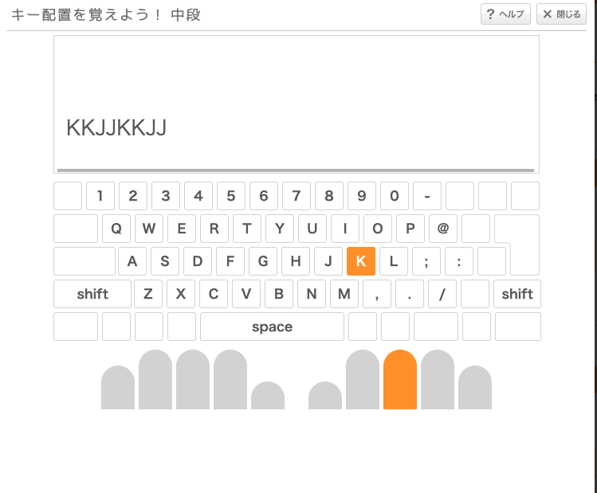
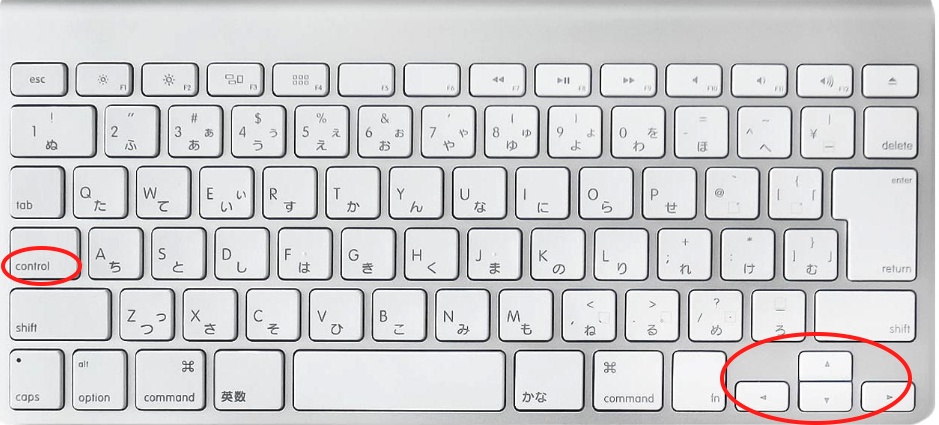

# おすすめツール10選

---

## 目的

<br> 
<br> 

- 自分の中での3年の振り返り、整理
    - 文系未経験、ブラインドタッチできない、くらいのレベル感スタート

- **質より量** で一つでも刺さる情報があれば
    - こっちのツールを使った方がいいとかの押し売りではない！
    - 「こんなのあるよ」って共有程度の認識で！

- **むしろ俺のオススメはこれだぜ** を知りたい

---

## 1. タイピング(e-typing)

<br> 
<br> 

- [ホームポジションで入力するための指の動かし方を覚える](https://azby.fmworld.net/usage/lesson/keyboard/typing/basic/roma.html)
  - 闇雲に練習しない！その方法が正しいか考える
  - 自己流フォームを絶対に矯正する必要はないと思う



<!--
TODO: 画像サイズの調整
-->

---

## 1. タイピング(e-typing)

<br> 
<br> 

- [ホームポジションで単語を入力する](https://www.e-typing.ne.jp/roma/variety/business.asp)


---

## 2. Macショートカット

<br> 
<br> 

- [十字キーが小さいし、Controlキーを使用する](https://gori.me/mac/mac-tips/16350)



---

## 2. Macショートカット

<br> 
<br> 

- カーソル移動 -> Control + b,f,p,n,a,e

- 削除 -> Control + h,d,a→k

- コマンドラインの基本操作のショートカットと共通のものが多い
  - Linux サーバ内での操作でも役に立つ

---

## 3. [Visual Studio Code](https://azure.microsoft.com/ja-jp/products/visual-studio-code/)

<br> 
<br> 

- [マルチカーソルを使わないVSCodeはただのVSCodeだ！](http://mugi1.hateblo.jp/entry/vscode_multi_cursor)

- チーム単位で extention の管理が可能

```shell {all|4-7|all}
$ cat .vscode/extensions.json      
{
        // List of extensions which should be recommended for users of this workspace.
        "recommendations": [
                "editorconfig.editorconfig",
                "ms-vsliveshare.vsliveshare"
        ],
        // List of extensions recommended by VS Code that should not be recommended for users of this workspace.
        "unwantedRecommendations": []
}
```

---

## 4. [peco](https://github.com/peco/peco#demo)

<br> 
<br> 

- [control+r のヒストリー検索で有効にするとコマンドラインの操作が快適に](https://github.com/KiyotaTakeshi/dotfiles/blob/master/shell/zsh/.zshrc#L25-L33)


---

## 5. 本

<br> 
<br> 

- ググる時に使える知識を増やす

- おすすめ
    - [絵で見てわかるITインフラの仕組み](https://www.shoeisha.co.jp/book/detail/9784798158464)
    - [新しいLinuxの教科書](https://www.sbcr.jp/product/4797380941/)
    - [UNIXという考え方](https://www.ohmsha.co.jp/book/9784274064067/)

- そろそろ骨太な本も読み進めていきたい
---

## 6. [Udemy](https://www.udemy.com)

<br> 
<br> 

- [もう怖くないGit！チーム開発で必要なGitを完全マスター](https://www.udemy.com/course/unscared_git/)
    - 図が多くイメージで理解できる
    - ある程度コマンドラインで git を扱えるようになる

- [これだけでOK！ AWS 認定ソリューションアーキテクト – アソシエイト試験突破講座](https://www.udemy.com/course/aws-associate/)
    - 解説付きの模試と豊富なハンズオンでAWSの主要サービスの雰囲気が掴める
    - SA はこれで勉強して取れた
    - Next Step は [Terraform](https://www.terraform.io/) とか IaC ツールの学習をすすめるとよさそう

- [Cisco CCNA Packet Tracer Ultimate labs: CCNA Exam prep labs](https://www.udemy.com/course/cisco-ccna-packet-tracer-ultimate-labs-ccna-exam-prep-labs/)
    - Packet Tracer を触ることで CCNAレベルのネットワークの知識を手を動かして学べる

---

## 7. [Packet Tracer](https://www.netacad.com/ja/courses/packet-tracer)

<br> 
<br> 

- Ciscoが公式に提供しているネットワーク機器のシミュレータ
    - スイッチやルータをコマンドで設定して ping が通るかを確認する
    - フレームにVlanタグをつけるところやパケットの中身まで見れる

- **MAC 版が出たらしい！！！**
---

## 7. [Packet Tracer](https://www.netacad.com/ja/courses/packet-tracer)

<br> 
<br> 


---

# 8. [Quora](https://jp.quora.com)

<br> 
<br> 

- 回答の質の高いyahoo知恵袋

    - [reactの基本がnode.jsだと聞いたのですがどういうことですか？書き方が同じということですか？まだ全くの初心者なのでやさしく教えていただけると助かります。](https://qr.ae/TWs5dz)

    - [MongoDBの様なNoSQLに勢いがあるのは何故ですか？SQLと比べてどんな利点や欠点がありますか？](https://qr.ae/TWPo3v)

    - [ディープラーニングの研究が進めばAIのブラックボックス問題は解決しますか？](https://qr.ae/TWPomi)

---

## 9. 自作パソコン

<br> 
<br> 

- メモリ、CPU、マザーボード、電源、SSD を規格を確かめながら組むことでハードウェアが身近なものに

- 一回組み立ててみたことで AWS の設定値の意味を実感を持って理解できた

---

## 9. 自作パソコン

<br> 
<br> 

- ベアボーンのサイズ感が魅力的過ぎて、[DeskMini A300](https://www.asrock.com/nettop/AMD/DeskMini%20A300%20Series/index.jp.asp) に換装


---

## 10. キーボード

<br> 
<br> 

- [分割キーボード入門編の Kinesis Freestyle2 Keyboard ](https://www.edikun.co.jp/kinesis/freestyle.htm)
    - 肩が開くので、肩こりにいいだとか

- [REALFORCE for Mac](https://www.pfu.fujitsu.com/direct/realforce/detail_pz-r2tlus4mwh.html)
    - 静電容量無接点方式キースイッチらしい
    - 麻雀牌を触っているかのような??心地よさ

---

## まとめ

<br> 
<br> 

- 買ってみる、やってみる
    - 大体のことはコストをかけずにできる時代！
    - 後は、可処分時間との戦い...

---

## おまけ

<br> 
<br> 

- Markdown でスライドが作れる [sli.dev](https://sli.dev/) を使ってみた
    - Git 管理できて良さそう
    - コードをたくさん入れるなら便利な機能が色々ありそう
    - [presenter mode](http://localhost:3030/presenter/18)

<!--
これはカンペです
-->
